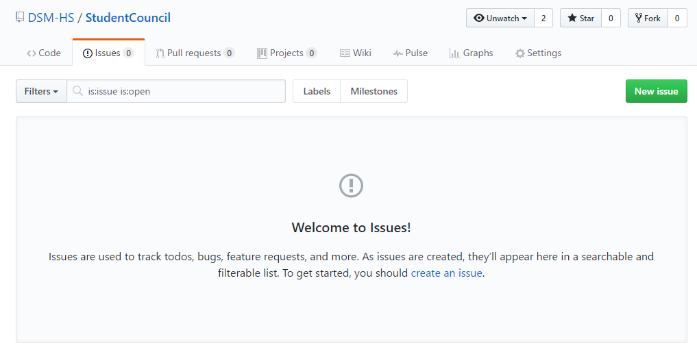
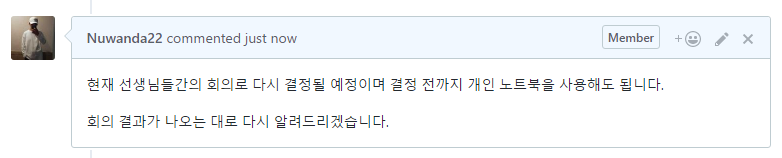

# Student Council
학생회의 관한 레포지토리로서 대덕소프트웨어마이스터고 특성상 GitHub를 사용하는 것이 좋기 때문에 학생회 차원에서 학생들의 **GitHub 사용을 권장**하며 **학생회와 학생의 원활한 소통**을 위해 생성되었다.

## 안건 제시
학생들이 학생회에 안건을 쉽게 제시할 수 있도록 한다.

### 제시 방법
1. Issues 탭에서 New issue를 누른다.

2. 안건에 대하여 알기 쉽게 제목을 작성하고 안건에 관한 내용을 자세히 작성한다.

### 안건 진행
1. 학생회는 안건의 진행 상황을 코멘트를 통해 알린다.

2. 해결 시 코멘트 후 이슈를 닫는다.

## 회의 내용 공개
회의에 토의된 내용을 공개한다.