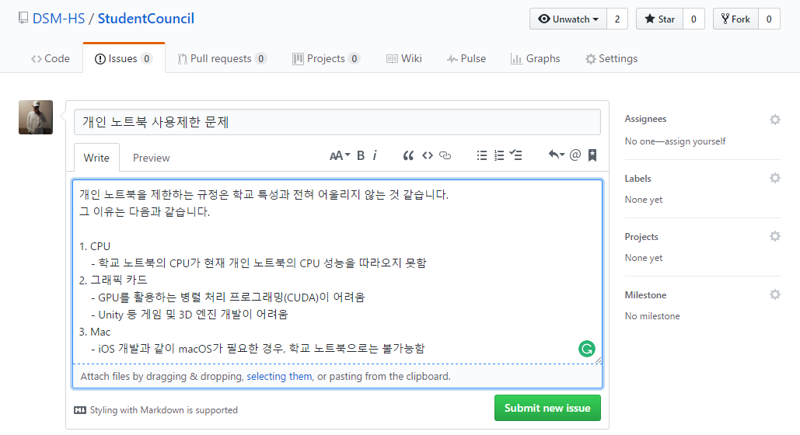
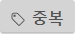

# Student Council
대덕소프트웨어마이스터고등학교 학생회 레포지토리

## 설립 목적
1. 학교 특성상 학생들이 GitHub를 사용하는 것을 권장
2. 이슈와 같은 문제에 대한 관리가 편리
3. 학생회와 학생간의 소통 창구를 필요

# 안건 제시
학생들이 학생회에 안건을 쉽게 제시할 수 있도록 한다.

## 제시 방법
1. Issues 탭에서 New issue를 누른다.

2. 안건 혹은 질문에 대하여 알기 쉽게 제목을 작성하고 내용을 자세히 작성한다.

3. 작성 후 내용에 맞는 Label를 붙인다. 

학생이 붙일 수 있는 라벨은 다음과 같다.

라벨|의미
-|-
| 고치길 원하는 학교의 문제
|학교에 추가되었으면 하는 것
|도움을 요청함
|궁금한 사항을 질문함

## 안건 진행
1. 학생회는 안건의 진행 상황을 코멘트와 라벨을 통해 알린다.

라벨|의미
-|-
|학생회 공지
|제시 안건이 승인됨
|제시 안건이 기각됨
|제시 안건 중 일부가 승인됨
|제시 안건 중 일부가 기각됨
|내용이 타 항목과 중복됨
|제시한 안건이 현실적으로 불가능함

2. 해결 시 코멘트 후 이슈를 닫는다.

# 회의 내용 공개
회의에 토의된 내용을 공개한다.

## 공개 자료
* 회의가 진행되며 기록된 내용
* 공개되는 되는 학생회 자료

## 공개 방법
1. 회의가 진행될 때마다 회의에 관한 내용을 기록한다.
2. 회의가 마무리된 후 회의 내용과 자료들을 한 폴더에 넣어 올린다.
