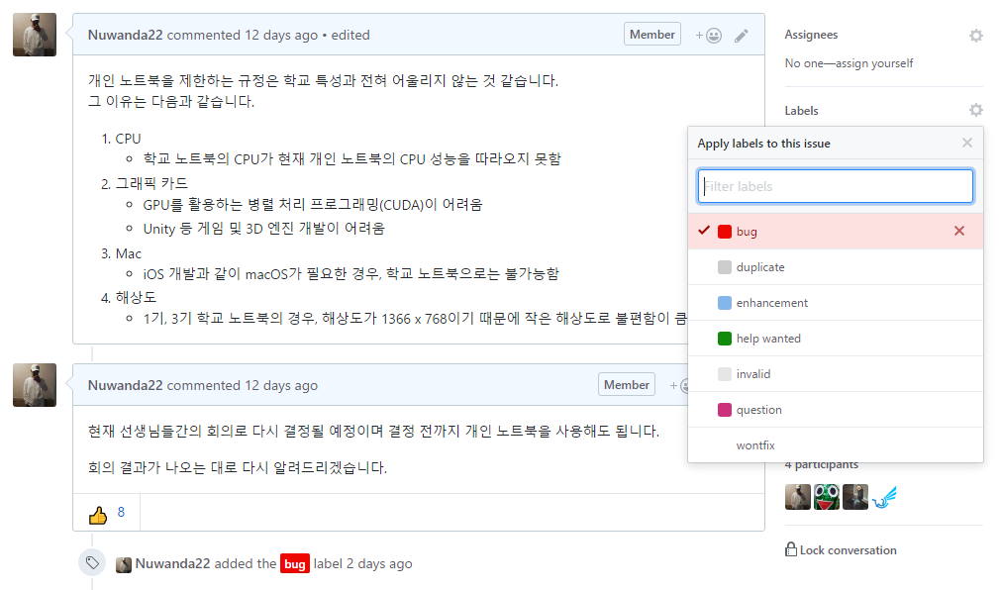
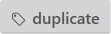
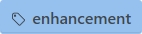
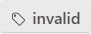
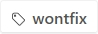

# Student Council
학생회의 관한 레포지토리로서 대덕소프트웨어마이스터고 특성상 GitHub를 사용하는 것이 좋기 때문에 학생회 차원에서 학생들의 **GitHub 사용을 권장**하며 **학생회와 학생의 원활한 소통**을 위해 생성되었다.

## 안건 제시
학생들이 학생회에 안건을 쉽게 제시할 수 있도록 한다.

### 제시 방법
1. Issues 탭에서 New issue를 누른다.

2. 안건에 대하여 알기 쉽게 제목을 작성하고 안건에 관한 내용을 자세히 작성한다.

3. (Optional) 작성 후 Label를 붙인다. _(Label의 각각의 의미는 밑 표를 참고하라)_

#### 이슈 라벨 의미
라벨|의미|close 되는 시점 
-|-|--
| 고치길 원하는 학교의 문제|문제 수정시
|내용이 타 항목과 중복됨|원본 링크를 남긴 후
|학교에 추가되었으면 하는 것|추가시
|도움 요청|해결시
|실현 불가능|안 되는 이유 작성 후
|질문|해결 및 납득시
|고치지 않을 것|고치지 않는 이유 작성 후

### 안건 진행
1. 학생회는 안건의 진행 상황을 코멘트를 통해 알린다.

2. 해결 시 코멘트 후 이슈를 닫는다.

## 회의 내용 공개
회의에 토의된 내용을 공개한다.

### 공개 자료
* 회의가 진행되며 기록된 내용
* 공개되는 되는 학생회 자료

### 공개 방법
1. 회의가 진행될 때마다 회의에 관한 내용을 기록한다.
2. 회의가 마무리된 후 회의 내용과 자료들을 한 폴더에 넣어 올린다.
